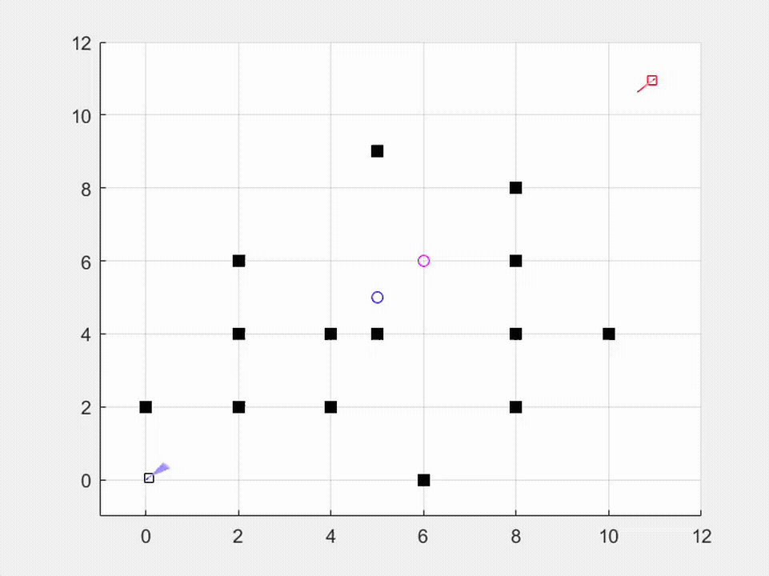
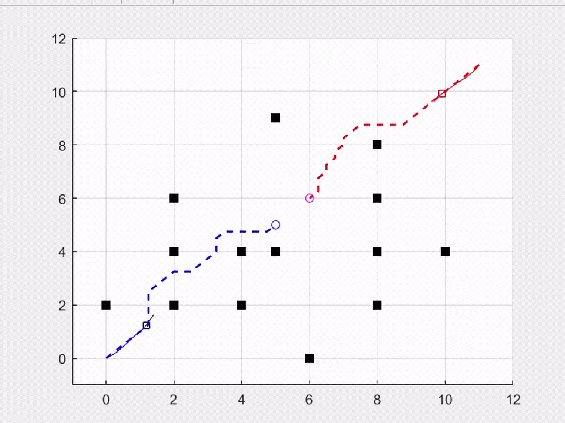
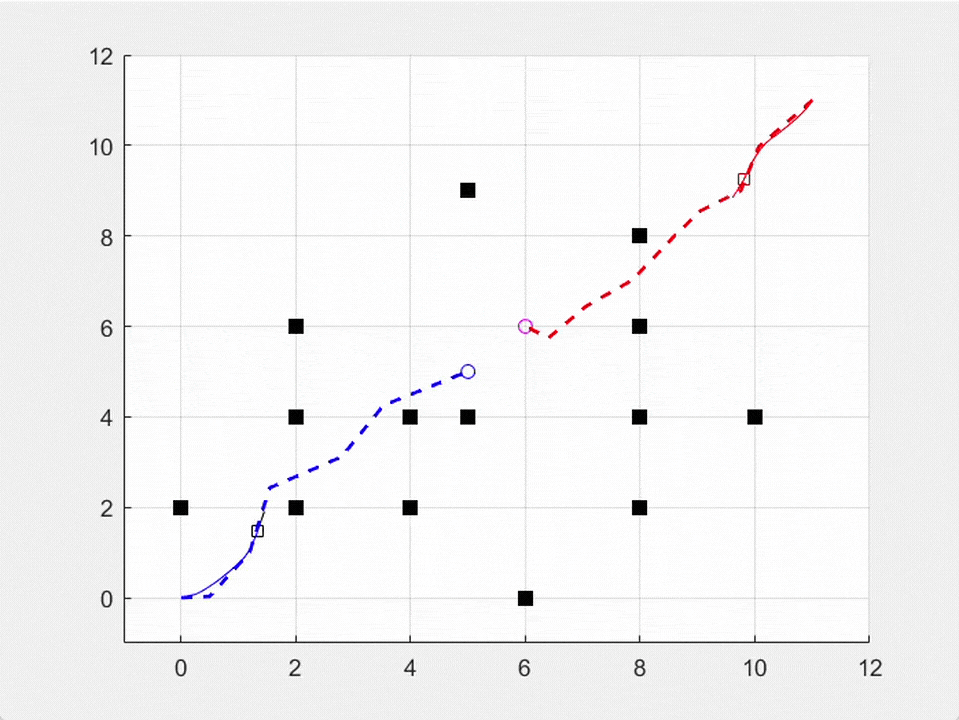

# Unicycle UGV Navigation with DWA, A* and RRT*

MATLAB simulation and visualization of path-planning algorithms for a unicycle-like unmanned ground vehicle.


## Overview

This project simulates the navigation of a unicycle-like mobile robot in a two-dimensional environment with static obstacles.

The MATLAB App Designer interface allows the user to define the robot's initial position and goal position, select a planning algorithm, and visualize the resulting navigation trajectory.

The available algorithms are:

- Dynamic Window Approach (DWA)
- A* search
- Rapidly-exploring Random Tree Star (RRT*)

## What Was Added in This Fork

This repository is an extension of the original [Navigation of a Unicycle-Like Vehicle](https://github.com/turhancan97/Navigation-of-a-Unicycle-Like-Vehicle) project.

The main additions are:

- Selection between multiple path-planning algorithms
- Grid-based A* path planner
- Sampling-based RRT* path planner
- Updated MATLAB App Designer interface
- DWA parameter testing and automatic tuning utilities
- Additional simulation results and visualizations

## Algorithms

| Algorithm | Category | Description |
|---|---|---|
| DWA | Local, velocity-space planner | Evaluates dynamically feasible linear and angular velocities and selects a short-horizon trajectory based on goal heading, obstacle clearance, and velocity. |
| A* | Grid-based global planner | Searches an eight-connected occupancy grid using movement cost and a goal-distance heuristic. |
| RRT* | Sampling-based global planner | Builds a random search tree and rewires nearby nodes to improve the generated path. |

## Results

### MATLAB Application

<p align="center">
  
</p>

The interface can be used to:

- Set the initial and goal coordinates
- Select the navigation algorithm
- Start, pause, continue, or stop the simulation
- Visualize the robot trajectory
- Inspect motion and navigation results

### Algorithm Demonstrations

<table>
  <tr>
    <th>Dynamic Window Approach</th>
    <th>A* Search</th>
    <th>RRT*</th>
  </tr>
  <tr>
    <td>
      
    </td>
    <td>
      
    </td>
    <td>
      
    </td>
  </tr>
</table>


## Requirements

- MATLAB R2021b or newer
- MATLAB App Designer

The project may also work with earlier MATLAB versions, but it was designed around the App Designer workflow.

## Installation

Clone the repository:

```bash
git clone https://github.com/andreikotkov/Navigation-of-Unicycle-UGV-DWA-A-RRT.git
cd Navigation-of-Unicycle-UGV-DWA-A-RRT
```

## Running the Application

1. Open MATLAB.
2. Set the cloned repository as the current MATLAB folder.
3. Open `run.mlapp`.
4. Click **Run** in App Designer.
5. Enter the initial and goal coordinates.
6. Select a planning algorithm.
7. Start the simulation.

The navigation environment uses coordinates within the limits defined by the application. The initial and goal positions must be different and must not overlap with obstacles.

## Obstacle Maps

The repository contains several obstacle configurations:

```text
obstacle.txt
obstacle2.txt
obstacle3.txt
obstacle4.txt
```

These files can be modified to test the planners in different environments.

When creating a custom map, ensure that:

- The initial position is collision-free
- The goal position is collision-free
- Sufficient clearance exists between obstacles
- All coordinates remain inside the simulation area

## Project Structure

| File | Purpose |
|---|---|
| `run.mlapp` | Main MATLAB App Designer interface |
| `DynamicWindowApproach.m` | Dynamic Window Approach implementation |
| `A_Star_Planner.m` | Grid-based A* planner |
| `RRT_Star_Planner.m` | Sampling-based RRT* planner |
| `CalcDynamicWindow.m` | Calculates reachable velocity ranges for DWA |
| `GenerateTrajectory.m` | Predicts candidate robot trajectories |
| `Evaluation.m` | Scores DWA trajectory candidates |
| `AutoTuner.m` | Searches for suitable DWA evaluation parameters |
| `SimulateRun.m` | Runs DWA test scenarios for parameter evaluation |
| `obstacle*.txt` | Obstacle-map definitions |

## Current Limitations

- The environment contains static obstacles
- The robot uses a simplified unicycle-like kinematic model
- A* path quality depends on the selected grid resolution
- RRT* results depend on random sampling
- The simulation does not model wheel dynamics, friction, or sensor uncertainty

## Possible Future Work

- Dynamic and moving obstacles
- Path smoothing for A* and RRT*
- Hybrid global and local planning
- Quantitative comparison of path length and planning time
- Automatic benchmark scenarios
- More realistic differential-drive robot dynamics
- Integration with ROS or a physics-based simulator

## Acknowledgements

This project is based on the original work by **Turhan Can Kargın** and **Adil Mortepe**:

[Navigation of a Unicycle-Like Vehicle](https://github.com/turhancan97/Navigation-of-a-Unicycle-Like-Vehicle)

The original project implemented the Dynamic Window Approach in MATLAB. This fork extends it with selectable planning algorithms, including A* and RRT*, together with additional simulation and tuning functionality.

## Author

**Andrei Kotkov**

## License

This project is distributed under the MIT License. See the [`LICENSE`](LICENSE) file for details.

The original copyright notice and license must be preserved.
